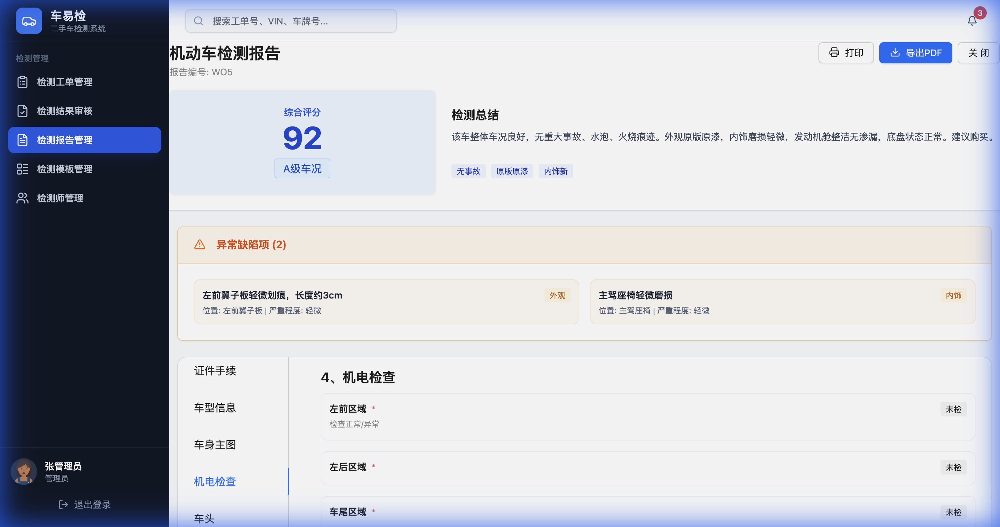

# Inspection-Vehicle Association & Ant Design Refactor

## Overview
This update completes the **Inspection-Vehicle Association** (One Car, One Archive / 一车一档) feature and fully refactors the core modules to **Ant Design**.

## Key Features

### 1. Inspection-Vehicle Association (One Car, One Archive)
- **Concept**: Links an inspection report (Work Order) to a unique Vehicle Archive in the database.
- **Data Model**: Added `VehicleArchive` interface and `archiveId` parameter to Work Orders/Reports.
- **Reports Module**:
  - Added **"Association Status"** column.
  - Implemented **"Link Vehicle Archive" Modal**:
    - **Smart Search**: Search inventory by VIN or Plate.
    - **One-Click Link**: Associate report with existing vehicle.
    - **Create & Link**: Simulate creating a new vehicle archive from the report data.
- **Audit Module**:
  - Added **"Link to Archive"** check during the approval process.
  - Verification: Approving with the check enabled confirms the association.

### 2. Ant Design UI Refactor
- **Reports Module**: Switched to AntD Table, Modal, Button, Tag, etc. Fixed "Details Review" bug.
- **Audit Module**: Switched to AntD. Implemented inline Detail View with validation controls.
- **Inspectors Module**: Switched to AntD. Used Cards for stats and Form for editing.

## Technical Details
- **Mock Data**: Added `vehicleArchives` to `src/data/mock.ts` to simulate the inventory database.
- **State Management**: Local state in `Reports/index.tsx` tracks unlinked items for demonstration.

## User Guide
- **Linking a Report**: Go to "Reports", click "Connect" (purple/blue button) on an unlinked report. Use the modal to search/create.
- **Unlinking**: Click "Unlink" (red button) to remove the association (with confirmation).
- **Audit Approval**: In "Audit", approve a report and ensure "Associate with Vehicle Archive" is checked.

### 3. Report Detail Page Refactor
- **Goal**: Align the detailed view with the new `InspectionTemplate` logic and provide a professional, data-rich presentation.
- **Key Changes**:
    - **Dynamic Rendering**: Categories and items are now rendered based on the active template (e.g., Fuel vs. EV).
    - **Full-Page Experience**: Replaced the small modal with a full-page detailed view.
    - **Core Metrics Header**: Prominently displays Comprehensive Score and Grade.
    - **Defect Summary**: Dedicated section for "Abnormal/Defect Items" at the top for quick review.
    - **Category Navigation**: Left-side tabs for easy switching between main inspection areas (Engine, Chassis, Interior, etc.).

